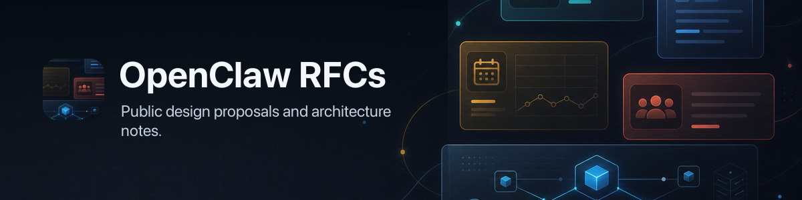

# OpenClaw RFCs



This repository stores design proposals and longer-form technical decisions for
OpenClaw.

## Structure

RFC documents live under the `rfcs/` subdirectory at the repository root:

```text
.
├── LICENSE
├── README.md
└── rfcs/
    ├── 0000-template.md
    ├── <id>-<short-name>.md
    └── <id>/
```

New RFCs should use the template and follow the structure below when diagrams or
supporting assets are needed:

```text
.
├── LICENSE
├── README.md
└── rfcs/
    ├── 0000-template.md
    ├── <id>-<short-name>.md
    └── <id>/
        ├── architecture-overview.png
        ├── implementation-plan.md
        └── other-assets...
```

The Markdown file is the RFC. The sibling `<id>/` directory inside `rfcs/` is
optional and is used for referenced supporting material that would make the RFC
body harder to review inline. This can include diagrams, screenshots, example
checklists, inventories, implementation plans, or other sidecar artifacts.

## Naming

- `rfcs/0000-template.md` is the starter template for new RFCs.
- New RFCs should be named `<id>-<short-name>.md`.
- When an RFC has supporting assets or sidecar material, store them under a
  sibling folder inside `rfcs/` named exactly `<id>/`.

Example:

```text
.
└── rfcs/
    ├── 0123-policy-runtime-hardening.md
    └── 0123/
        └── architecture-overview.png
```

## Asset References

Reference assets with repo-relative paths from the RFC file:

```md

```

This keeps the RFC portable and lets GitHub render the document and images
together.

## RFC Template Shape

New RFCs should start from [`rfcs/0000-template.md`](./rfcs/0000-template.md).
The template keeps a compact RFC shape while borrowing the core proposal habits
from Go and Rust: short summary, explicit motivation, concrete proposal text,
rationale for the chosen approach, and clear unresolved questions.

## RFC Lifecycle

New RFCs start as pull requests and should not be merged to `main` while still
in `draft` status.

Each new RFC also needs a discussion thread in
[`maintainer-discussion`](https://discord.com/channels/1456350064065904867/1466324351862177815).

The expected flow is:

1. Open the RFC as a PR with `status: draft`.
2. Leave `issue` blank until the RFC is accepted.
3. Create a discussion thread in `maintainer-discussion`.
4. If the RFC is accepted, create a GitHub issue for implementation, update the
   RFC to `status: accepted`, set `issue` to the GitHub issue URL, and then
   merge the RFC.
5. Once implementation is complete, update the RFC status to `completed`.

RFC metadata should live in YAML frontmatter at the top of each RFC. The
template currently uses these metadata keys:

- `title`
- `authors`
- `created`
- `last_updated`
- `status`
- `issue`
- `rfc_pr`

For new RFCs:

- `status` starts as `draft`
- `issue` starts blank
- `rfc_pr` should point to the RFC pull request

The expected top-level sections are:

- `Summary`
- `Motivation`
- `Goals`
- `Non-Goals`
- `Proposal`
- `Rationale`
- `Unresolved questions`

## Authoring Notes

- Keep one RFC per Markdown file.
- Use the sidecar asset folder only when the RFC needs diagrams, screenshots, or
  other supporting files.
- Prefer stable filenames for images so review comments and links do not churn.
- Keep assets specific to one RFC in that RFC's own `<id>/` directory rather
  than creating a shared global asset folder.
- Keep `Summary` to one paragraph.
- Use `Motivation` to explain why the change is necessary.
- Use `Goals` to define what success looks like for the proposal.
- Use `Non-Goals` to define what is intentionally out of scope.
- Use `Proposal` to describe what is changing.
- Use `Rationale` to compare alternatives and explain the tradeoffs in the
  chosen design.
- Use `Unresolved questions` to call out relevant gaps or follow-up areas that
  are intentionally not addressed by the proposal.
