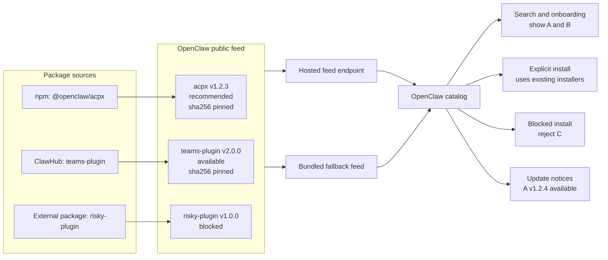
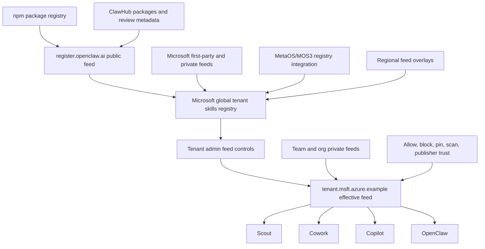
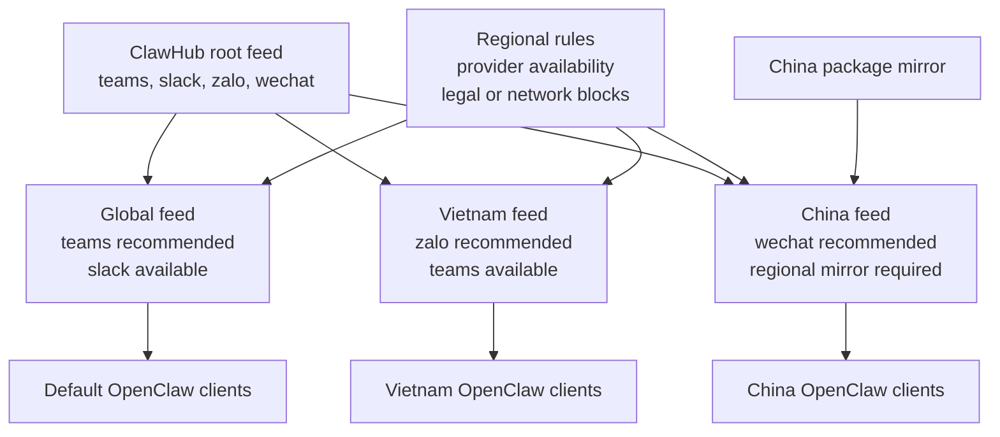

# Proposal: Hosted Feeds for Plugins and Skills

## Summary

Define a hosted feed model for OpenClaw plugins and skills. A feed is a JSON
catalog document that describes available packages, version and integrity
metadata, package-source references, and feed-level governance state such as
recommended, disabled, blocked, or update available. A package-source reference
is a name that the local OpenClaw deployment maps to npm, ClawHub, Git, or a
private registry configuration. OpenClaw should move the existing file-backed
external plugin catalog to this feed model first, keep a bundled fallback for
offline environments, and later extend the same contract to skills and
organization-specific catalogs.

The first implementation should preserve the package model OpenClaw already
uses. External plugins can continue to install from npm or ClawHub, with Git
available for immutable source installs. The feed provides package selection,
version, and checksum data; local configuration supplies the source endpoint,
credentials, and trust policy. ClawHub can publish the default public feed.
Organizations can publish effective feeds by subsetting, filtering, or
augmenting ClawHub feeds with private entries and policy decisions.

## Motivation

OpenClaw is moving more plugins out of the base install and into external
packages. The current external plugin registry is local and file-backed, which
works as a bundle-time manifest but does not give OpenClaw or downstream
distributions a clean way to update recommendations, disable problematic
plugins, regionalize provider availability, or let enterprises expose only the
plugins they approve.

A hosted feed gives OpenClaw a small, cacheable, reviewable distribution
primitive. OpenClaw can fetch the public feed when online, detect changes
through HTTP validators plus a locally computed payload checksum, and fall back
to the bundled feed when offline or blocked. ClawHub can curate the default
public experience. Microsoft, other enterprises, and regional mirrors can consume
ClawHub feeds, apply their own policy and private entries, and publish an
effective feed to their clients.

This also aligns OpenClaw with proven package ecosystems. npm, Homebrew taps,
and marketplace catalogs separate package storage from catalog composition. The
feed should be the catalog and governance layer, while package registries such
as npm, ClawHub, private Git repositories, and enterprise registries remain the
package source layer.

## Goals

- Replace the bundled-only external plugin catalog with a hosted JSON feed plus
  bundled fallback.
- Preserve existing npm-backed and ClawHub-backed external plugin installs,
  including package version and artifact integrity checks.
- Define named local source profiles so deployments can select or override npm
  registry paths, ClawHub base URLs, Git hosts, and credentials without changing
  the feed format.
- Define immutable Git source installs using full commit hashes.
- Define a feed entry shape for plugins first, with room for skills and other
  package types.
- Support edge-hosted feed variants so provider availability can differ by
  geography or deployment environment without requiring clients to interpret a
  complex regional policy language.
- Let ClawHub publish one or more public feeds for OpenClaw clients.
- Let enterprises publish composed effective feeds that subset, block, pin, or
  augment public feeds.
- Support private organization and team feeds without forcing OpenClaw to own
  the private registry RBAC model.
- Let clients check feeds on a named, lifecycle-owned refresh schedule using
  HTTP `Last-Modified` and `ETag`.
- Support signed remote feeds with directly configured publisher keys first,
  while leaving room for a later signed key-rotation document if ClawHub needs
  remote publisher-key rotation.
- Keep a bundled feed in every OpenClaw build so offline, Docker, and
  air-gapped environments continue to work.
- Create an RFC and implementation plan that ClawHub, Microsoft, Tencent,
  Xiaomi, and other regional ecosystems can align on before incompatible feed
  formats emerge.

## Non-Goals

- Replacing ClawHub as the public registry and discovery surface.
- Replacing npm, ClawHub package storage, private Git repositories, or private
  enterprise registries as package sources.
- Automatically installing or updating plugins or skills without user action.
- Defining the full end-user onboarding redesign.
- Defining runtime tool-call policy enforcement such as MCP method blocking or
  parameter clamping.
- Making feed membership a guarantee that package code is safe.
- Requiring every enterprise to use Microsoft MOS3 or any specific hosted
  registry.
- Solving private registry authentication or RBAC inside the feed format.
- Allowing a feed to define registry domains, credentials, or bootstrap trust
  keys for the client that consumes it.

## Proposal

OpenClaw should treat feeds as the catalog primitive underneath plugin and skill
marketplace experiences. A feed is fetched from an HTTP endpoint or loaded from a
local file. The client validates the document shape, verifies a configured
signature policy when present, and uses entry-level package metadata to drive
recommendations, installs, update notices, and feed-level allow/block decisions.
Registry-owned search can still remain with ClawHub or another marketplace
service. In that model the registry returns ranked results, and the OpenClaw
client filters or annotates those results against the configured feeds before
showing or installing them.

The initial implementation should refactor the existing external plugin catalog
rather than introduce a parallel catalog. Today the relevant OpenClaw entry
points are:

- `src/plugins/official-external-plugin-catalog.ts`, the generated TypeScript
  catalog entry point.
- `scripts/lib/official-external-plugin-catalog.json`, the actual package data.
- `openclaw.install.npmSpec`, the existing npm package install metadata.
- `src/wizard/setup.official-plugins.ts`, the onboarding reader.
- `src/commands/onboarding-plugin-install.ts`, the install executor.

The first feed version should preserve those semantics while moving the catalog
source from bundled-only JSON to hosted JSON with bundled fallback.

### Feed document

A feed document should be a deterministic JSON document with a schema version,
feed id, generated timestamp, monotonic sequence number, expiry, and entries.
Entry ids must be stable registry identities, not mutable display slugs. If a
registry allows user-editable slugs, the feed should either carry an immutable
package id or use the canonical package coordinate as the stable id. Display
slugs and titles can still appear as metadata, but installs and policy decisions
should not depend on them. Publisher trust should start with ClawHub's current
binary distinction of official or not official, rather than inventing reviewed or
verified publisher labels in the first feed. Entries select a configured local
source by name using `sourceRef` rather than embedding a registry domain,
credentials, or trust roots.

```jsonc
{
  "schemaVersion": 1,
  "id": "clawhub-official",
  "generatedAt": "2026-06-18T00:00:00.000Z",
  "sequence": 42,
  "expiresAt": "2026-06-25T00:00:00.000Z",
  "entries": [
    {
      "type": "plugin",
      "id": "acpx",
      "title": "ACP-X",
      "version": "1.2.3",
      "state": "recommended",
      "publisher": {
        "id": "openclaw",
        "trust": "official"
      },
      "install": {
        "candidates": [
          {
            "sourceRef": "public-npm",
            "package": "@openclaw/acpx",
            "version": "1.2.3",
            "integrity": "sha512-..."
          }
        ]
      }
    }
  ]
}
```

The initial states should cover the known plugin catalog needs:

- `available`: entry can be shown and installed.
- `recommended`: entry can be highlighted by a client or tenant overlay, but it
  should not replace a registry-owned search ranking by itself.
- `disabled`: entry is known but intentionally not offered for new install from
  this feed. This is useful for temporary availability, rollout, or regional
  reasons where the package may still exist elsewhere.
- `blocked`: entry is an explicit deny decision. A composed feed can use this to
  remove or override an entry inherited from a parent feed.
- `deprecated`: entry remains visible for migration but should not be selected
  for new installs.

The exact enum names can change during implementation, but the RFC should keep
these concepts separate. A recommended package is not the same as a merely
available package. A disabled package is not the same as a blocked package:
`disabled` means unavailable from this feed, while `blocked` means explicitly
denied by this feed.

### Local feed and source configuration

Feed names and source profile names are deployment-local. There is no
`enterprise` feed or registry shape. A deployment can name feeds and sources
after its own topology, while a feed entry refers only to a configured
`sourceRef`. For example, `public-npm` is not a domain from the feed. It is a
local profile that OpenClaw resolves to an npm registry URL, credentials, and
installer behavior already trusted by that deployment.

```jsonc
{
  "catalog": {
    "feeds": {
      "clawhub-public": {
        "url": "https://registry.openclaw.ai/feeds/plugins",
        "refresh": {
          "onStartup": "if-stale",
          "interval": "6h",
          "jitter": "10m",
          "timeout": "10s",
          "maxStale": "7d"
        },
        "verification": {
          "mode": "signed",
          "rootKeys": [
            { "id": "root-2026", "publicKey": "base64:..." }
          ],
          "rootThreshold": 1,
          "trustUrl": "https://registry.openclaw.ai/feeds/plugins/trust"
        }
      },
      "acme": {
        "url": "https://packages.acme.example/openclaw/feed",
        "auth": {
          "scheme": "bearer",
          "secret": "<SecretRef>"
        },
        "refresh": { "interval": "6h", "timeout": "10s", "maxStale": "7d" },
        "verification": { "mode": "unsigned" }
      }
    },
    "sources": {
      "public-npm": {
        "type": "npm",
        "registry": "https://registry.npmjs.org/"
      },
      "acme-npm": {
        "type": "npm",
        "registry": "https://packages.acme.example/npm/",
        "auth": { "scheme": "npm-token", "secret": "<SecretRef>" }
      },
      "acme-clawhub": {
        "type": "clawhub",
        "baseUrl": "https://packages.acme.example/clawhub/",
        "auth": { "scheme": "bearer", "secret": "<SecretRef>" }
      },
      "acme-git": {
        "type": "git",
        "baseUrl": "ssh://git.acme.example/openclaw/",
        "auth": { "scheme": "ssh-agent" }
      }
    }
  }
}
```

`refresh.interval` names the normal feed check frequency. `onStartup`,
`jitter`, `timeout`, and `maxStale` make the lifecycle behavior explicit without
turning catalog freshness into a request-time polling concern. The refresh
service starts after the gateway is ready; onboarding, search, and installation
consume the current snapshot. The initial implementation belongs in the gateway
scheduled-service lifecycle in `src/gateway/server-runtime-services.ts`, not the
user-visible cron scheduler in `src/gateway/server-cron.ts`.

Feed and source authentication resolve existing secret references. The feed
document never contains an access token, registry credentials, SSH material, or
the source base URL. Unknown `sourceRef` values make an entry invalid rather than
allowing a remote feed to introduce a new artifact source.

Source profiles define the installer contract:

- `npm` selects a custom registry path and optional scoped authentication. The
  same profile must apply to both metadata resolution and package installation.
- `clawhub` selects a ClawHub-compatible base URL and optional bearer token.
- `git` selects an allowed Git host or base path. A feed candidate must name a
  full immutable commit hash, not a branch, tag, or floating ref. Git credentials
  remain local, normally through an SSH agent or configured credential helper.

`npm` and `clawhub` candidates use `package` and `version`. A `git` candidate
uses a repository path relative to its source profile and a full `commit` hash.
Every installable candidate carries the artifact integrity data appropriate to
its source type.

Plugin entries are the first installable feed type. Skill entries can use the
same discovery contract, but skill installation remains staged until the native
skill installer accepts catalog candidates. A ClawHub skill must not be routed
through the plugin installer merely because both appear in a feed.

Skills also need extra care because the Agent Skills specification does not
require a version, and ClawHub can index skills that are installed directly from
GitHub rather than mirrored by ClawHub. A feed candidate for such a skill should
be allowed to point at an approved GitHub source profile with `repo`, `path`, a
full commit hash, and a content hash. The feed should not assume every skill has
a ClawHub-hosted package artifact or a semantic version.

### Feed discovery and fallback

OpenClaw should have a default feed URL for the ClawHub public feed. At build or
deploy time, OpenClaw should also bundle the latest generated feed file. At
runtime the client should:

1. Load the bundled feed as the fallback catalog.
2. Start the lifecycle-owned refresh service after the gateway is ready.
3. On the configured schedule, make a conditional request using the last
   validated `ETag` or `Last-Modified` value.
4. On `304 Not Modified`, record a successful check without replacing the
   snapshot. On new content, validate the envelope, feed shape, signatures, and
   package-source references before accepting it.
5. Compute a `sha256` checksum over the exact accepted feed payload bytes after
   envelope verification. Persist that checksum with the feed snapshot. The
   checksum is local state, not a field inside the signed payload, so it is not
   self-referential.
6. Store the latest verified snapshot, HTTP validators, payload checksum, feed
   sequence, expiry, and signature metadata atomically in `state/openclaw.sqlite`.
7. Use the verified cached snapshot during transient failures. Once it exceeds
   `maxStale`, fall back to the bundled feed and report stale catalog status.

### Feed authenticity and rotating trust

HTTP validators detect a likely change but do not establish who authored it. A
signed feed uses a small envelope that carries the exact feed bytes and one or
more Ed25519 signatures:

```jsonc
{
  "type": "openclaw.signed-envelope.v1",
  "payloadType": "application/vnd.openclaw.catalog-feed+json;v=1",
  "payload": "base64url(exact UTF-8 feed JSON bytes)",
  "signatures": [
    { "keyid": "publisher-2026-q3", "sig": "base64:..." }
  ]
}
```

The client verifies the envelope before decoding the payload. Signing exact bytes
avoids a second JSON canonicalization contract. The configured public keys and
threshold are the initial trust anchor; a remote feed cannot bootstrap or replace
them. `verification.mode: "signed"` fails closed. An unsigned HTTPS feed requires
the explicit local `verification.mode: "unsigned"` opt-in.

Most feeds can use directly configured public keys. That should be the first
implementation. If ClawHub later needs remote signing-key rotation, the same
envelope format can wrap a small signed key-rotation document:

```jsonc
{
  "feedId": "clawhub-official",
  "sequence": 3,
  "expiresAt": "2026-09-01T00:00:00.000Z",
  "threshold": 1,
  "feedKeys": [
    { "id": "publisher-2026-q3", "publicKey": "base64:..." }
  ]
}
```

If key rotation is enabled, a locally configured root-key quorum verifies the
signed key-rotation document. The verified `feedKeys` quorum then verifies feed
envelopes. A key-rotation update must be signed by the currently trusted root
quorum, and the client persists the accepted sequence and expiry to reject
rollback and freeze attempts. Replacing root keys remains a local operator action
for emergency recovery. The bundled fallback is trusted as part of the shipped
OpenClaw artifact, not as an unsigned replacement for a configured signed remote
feed. `verification.trustUrl` is optional; when absent, the configured local keys
directly verify feed envelopes.



**Figure 1.** OpenClaw uses feeds as the catalog layer. The feed can recommend,
show, block, pin, and notify updates for individual plugin entries while package
artifacts remain in npm, ClawHub, or another package source. The hosted feed
provides fresh catalog state, the bundled fallback preserves offline behavior,
and OpenClaw continues to use existing plugin and skill installers for explicit
installs.

The fallback is required. Users run OpenClaw in Docker, offline networks,
restricted enterprise environments, and regions where the public ClawHub endpoint
may not be reachable. Feed support must improve the online catalog without
breaking those installs.

### Feed composition

Feeds should support composition by convention, even if the first OpenClaw
client only consumes the final effective feed. A composed feed can start from a
parent feed and apply local rules: include only some entries, block entries,
change recommendation state, pin versions, add private entries, or publish a
regional variant.

When multiple feeds or overlays mention the same stable entry id, the effective
state should be deterministic. The recommended first resolution order is:
`blocked` wins over every other state, then `disabled`, then `deprecated`, then
`recommended`, then `available`. Pinning a version or adding a private candidate
should not override a `blocked` decision unless the composing system explicitly
removes the block before publishing the final effective feed. ClawHub can ignore
recommendation overrides in its own public search ranking, while enterprises can
use recommendation and pinning metadata as tenant-local ranking or onboarding
overrides.

The screen-share model from the design discussion used `register.openclaw.ai` as
the public OpenClaw feed endpoint and a tenant endpoint such as
`tenant.msft.azure.example` as a composed feed. Those names are illustrative,
but the RFC should preserve the topology: clients consume a feed, and feed
entries select local package-source profiles for the actual artifact.



**Figure 2.** Enterprise composition keeps package sources such as npm and
ClawHub separate from the feed that clients consume, while allowing a global
enterprise registry, tenant admins, teams, and regional overlays to shape the
final effective feed.

Microsoft is one example of this pattern. ClawHub can publish the public feed at
an endpoint like `register.openclaw.ai`. MetaOS/MOS3 can integrate that feed
into a Microsoft global tenant skills registry, combine it with Microsoft
first-party and private feeds, and apply regional overlays. Tenant admins can
then further subset, block, pin, require scans, or restrict publishers before
publishing a tenant-scoped effective feed such as `tenant.msft.azure.example`.
Teams or organizations can contribute private feeds into that tenant layer when
the tenant permits it. Scout, Cowork, Copilot, and OpenClaw clients consume the
same effective feed contract. Other enterprises can publish the same shape from
their own registry, CI job, private Git repository, or static hosting service.

### Regional feeds

The feed model should allow regional variants. Some providers are only useful in
certain markets. Some providers may be unavailable or blocked in certain regions.
The simplest model is for ClawHub or a mirror to publish separate effective feed
documents per region and cache those documents at the edge. A client can then use
edge routing or an explicit configured regional feed URL. This avoids requiring
the first client to evaluate a complex `regions` field at install time.

A feed document may still carry human-readable regional metadata for review and
mirror operations, but regional selection should initially be a feed-selection
problem rather than a per-entry policy language. The bundled fallback can remain
global; if a distribution needs an offline regional fallback, it can bundle that
regional feed variant in its own build.



**Figure 3.** Regional feeds can share a root catalog while producing different
effective catalogs. One region can recommend Zalo, another can use a regional
mirror and recommend WeChat, and another can keep the default provider set.

Examples:

- A Vietnam feed can recommend Zalo during onboarding.
- A China feed can include providers and mirrors that only work in China.
- A region can temporarily disable or block an entry without requiring an
  OpenClaw application update.

### Feed governance versus runtime policy

Feeds own catalog governance. They decide what is present, recommended,
disabled, blocked, pinned, or eligible for update. They can carry metadata that
helps a policy engine make decisions.

Runtime policy remains separate. Tool-level MCP controls, such as disabling a
`send email` tool while allowing read-only tools, and parameter clamping, such
as restricting tool arguments to tenant-approved schemas, should not be hidden
inside the catalog contract. The RFC should leave room for feed entries to
reference policy metadata, but it should not make the feed format the runtime
policy engine.

### Marketplace naming

The user-facing surface can still be called a marketplace. The RFC should use
"feed" for the underlying protocol and artifact because it describes how the
catalog propagates through ClawHub, mirrors, enterprise registries, and clients.
A marketplace can be implemented on top of one or more feeds.

## Rationale

A hosted feed is the smallest change that unlocks remote catalog control without
requiring OpenClaw to become a hosted marketplace. It builds directly on the
existing external plugin catalog and npm install metadata. It also gives ClawHub
and enterprise administrators the same primitive: publish a catalog, let clients
verify it, and use existing package installers for the actual artifact.

A static JSON feed is easier to cache, mirror, review, and bundle than an API-only
registry. It can be hosted on edge infrastructure such as Cloudflare. It can be
copied into OpenClaw builds for fallback. It can be diffed in pull requests. It
can be mirrored by Tencent or other regional operators. It can also be generated
from richer systems such as ClawHub, MOS3, private Git repositories, or CI jobs.

This proposal deliberately separates the feed from package storage and source
configuration. npm already solves package distribution for current external
plugins. ClawHub can remain the public registry, marketplace, and package
discovery surface, including ownership of its own search algorithm. Organizations
can keep private artifacts in their own registries or Git hosts. The feed only
selects approved package candidates and records immutable integrity data; local
source profiles decide where those candidates resolve and how the client
authenticates.

The signed envelope is intentionally smaller than a full updater framework.
Directly configured publisher keys cover the normal case and should be enough for
the first release. If ClawHub later needs remote publisher-key rotation, a
separate signed key-rotation document can describe the currently valid feed
signing keys and expiry. That follow-up should be treated as a distinct design
step, not as a requirement for the first hosted feed.

The bundled fallback is not optional. Without it, a feed outage or blocked
endpoint would break onboarding and plugin discovery. With it, hosted feeds add
freshness and control while preserving today’s offline behavior.

## Rollout plan

1. Align on the RFC enough to proceed with implementation, including source
   profile terminology, search ownership, state precedence, signing scope, and
   the plugin-first rollout boundary.
2. Refactor the existing external plugin manifest so the current local catalog
   shape can be generated from a feed document.
3. Add named feed and source profiles, including npm registry overrides,
   ClawHub-compatible base URLs, Git base paths, and secret-reference
   authentication.
4. Add signed feed envelopes with directly configured keys for public hosted
   feeds. Self-hosted unsigned HTTPS feeds remain an explicit local opt-in.
5. Publish the first ClawHub-hosted feed for the current external plugin catalog.
   The first feed may include all current external entries; ClawHub can narrow
   future default feeds to official packages as the official catalog grows.
6. Update OpenClaw to load the bundled fallback, refresh hosted feeds after
   gateway startup, and store verified snapshots in SQLite.
7. Add conditional HTTP update detection with `ETag` and `Last-Modified`.
8. Add regional feed variants once the default hosted feed path is stable.
9. Extend the same discovery contract to skills after the skill installer
   accepts catalog candidates, including GitHub-indexed skills that do not have
   ClawHub-hosted artifacts.
10. Add composition guidance and examples for Microsoft/MOS3 and other
    tenant-admin systems.
11. Align Tencent, Xiaomi, and other regional mirrors before the spec is treated
    as stable.
12. Land implementation through small draft PRs that maintainers can review,
    adjust, and merge as the RFC stabilizes.

## Unresolved questions

- Which `npm`, `clawhub`, and `git` source-profile fields should become stable
  user configuration, and which should remain installer implementation details?
- Should regional selection be edge-routed, explicit-feed configured,
  tenant-driven, or a combination after the first global feed works?
- Should OpenClaw use "marketplace" for the user-facing surface and reserve
  "feed" for the protocol and propagation artifact?
- Which runtime policy metadata should feed entries be allowed to reference
  without turning the feed into a policy engine?
- How many stable OpenClaw releases should ship hosted feed fallback before
  Scout, Microsoft, and other clients depend on the contract?
- Should a later LTS release define stronger compatibility guarantees for feed
  schema versions and fallback behavior?
