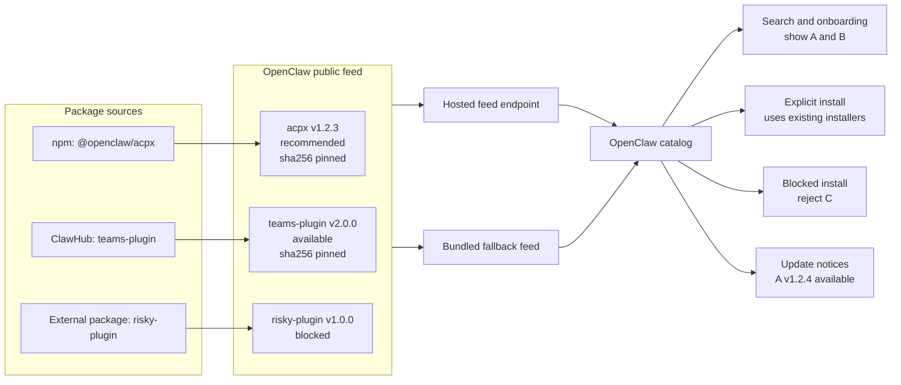
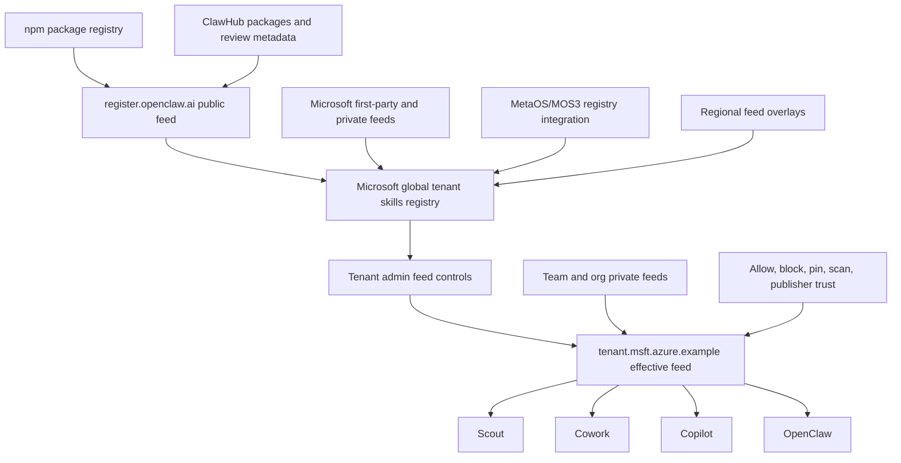
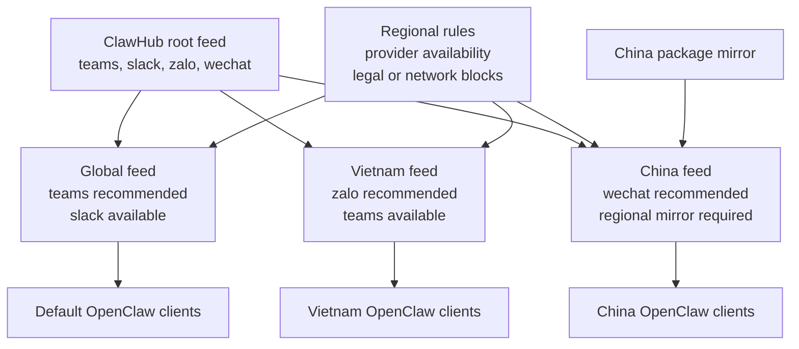

# Proposal: Hosted Feeds for Plugins and Skills

## Summary

Define a hosted feed model for OpenClaw plugins and skills. A feed is a JSON
catalog document that describes available packages, version and integrity
metadata, package-source references, and feed-level governance state such as
recommended, disabled, blocked, or update available. A package-source reference
is a name that the local OpenClaw deployment maps to npm, ClawHub, Git, or a
private registry configuration. OpenClaw should move the existing file-backed
external plugin catalog to this feed model first, keep a bundled fallback for
offline environments, and later extend the same contract to skills and
organization-specific catalogs.

The first implementation should preserve the package model OpenClaw already
uses. External plugins can continue to install from npm or ClawHub, with Git
available for immutable source installs. The feed provides package selection,
version, and checksum data; local configuration supplies the source endpoint
and credentials. ClawHub can publish the default public feed and other
ClawHub-hosted public, named, account, organization, or composed feeds. Those
ClawHub-hosted feeds should be signed by the ClawHub platform feed-signing key,
with the matching public key bundled in OpenClaw so ordinary ClawHub feed use is
zero-config. Organizations can publish effective feeds by subsetting, filtering,
or augmenting ClawHub feeds with private entries and policy decisions.

## Motivation

OpenClaw is moving more plugins out of the base install and into external
packages. The current external plugin registry is local and file-backed, which
works as a bundle-time manifest but does not give OpenClaw or downstream
distributions a clean way to update recommendations, disable problematic
plugins, regionalize provider availability, or let enterprises expose only the
plugins they approve.

A hosted feed gives OpenClaw a small, cacheable, reviewable distribution
primitive. OpenClaw can fetch the public feed when online, detect changes
through HTTP validators plus a locally computed payload checksum, and fall back
to the bundled feed when offline or blocked. ClawHub can curate the default
public experience. Microsoft, other enterprises, and regional mirrors can consume
ClawHub feeds, apply their own policy and private entries, and publish an
effective feed to their clients.

This also aligns OpenClaw with proven package ecosystems. npm, Homebrew taps,
and marketplace catalogs separate package storage from catalog composition. The
feed should be the catalog and governance layer, while package registries such
as npm, ClawHub, private Git repositories, and enterprise registries remain the
package source layer.

## Goals

- Replace the bundled-only external plugin catalog with a hosted JSON feed plus
  bundled fallback.
- Preserve existing npm-backed and ClawHub-backed external plugin installs,
  including package version and artifact integrity checks.
- Define named local source profiles so deployments can select or override npm
  registry paths, ClawHub base URLs, Git hosts, and credentials without changing
  the feed format.
- Define immutable Git source installs using full commit hashes.
- Define a feed entry shape for plugins first, with room for skills and other
  package types.
- Support edge-hosted feed variants so provider availability can differ by
  geography or deployment environment without requiring clients to interpret a
  complex regional policy language.
- Let ClawHub publish one or more public feeds for OpenClaw clients.
- Let enterprises publish composed effective feeds that subset, block, pin, or
  augment public feeds.
- Support private organization and team feeds without forcing OpenClaw to own
  the private registry RBAC model.
- Let clients check feeds on a named, lifecycle-owned refresh schedule using
  HTTP `Last-Modified` and `ETag`.
- Support signed remote feeds. ClawHub-hosted feeds should verify against a
  bundled ClawHub platform public key by default; third-party and self-hosted
  feeds use directly configured publisher public keys first, with room for
  later publisher key-management work if ClawHub or enterprise feed publishers
  need remote key rotation.
- Keep a bundled feed in every OpenClaw build so offline, Docker, and
  air-gapped environments continue to work.
- Create an RFC and implementation plan that ClawHub, Microsoft, Tencent,
  Xiaomi, and other regional ecosystems can align on before incompatible feed
  formats emerge.

## Non-Goals

- Replacing ClawHub as the public registry and discovery surface.
- Replacing npm, ClawHub package storage, private Git repositories, or private
  enterprise registries as package sources.
- Automatically installing or updating plugins or skills without user action.
- Defining the full end-user onboarding redesign.
- Defining runtime tool-call policy enforcement such as MCP method blocking or
  parameter clamping.
- Making feed membership a guarantee that package code is safe.
- Requiring every enterprise to use Microsoft MOS3 or any specific hosted
  registry.
- Solving private registry authentication or RBAC inside the feed format.
- Allowing a feed to define registry domains, credentials, or bootstrap trust
  keys for the client that consumes it.
- Reusing OpenClaw platform signing identities, Apple certificates, or release
  signing material as feed signing keys.

## Proposal

OpenClaw should treat feeds as the catalog primitive underneath plugin and skill
marketplace experiences. A feed is fetched from an HTTP endpoint or loaded from a
local file. The client validates the document shape, verifies a configured
signature policy when present, and uses entry-level package metadata to drive
recommendations, installs, update notices, and feed-level allow/block decisions.
Registry-owned search can still remain with ClawHub or another marketplace
service. In that model the registry returns ranked results, and the OpenClaw
client filters or annotates those results against the configured feeds before
showing or installing them.

The initial implementation should refactor the existing external plugin catalog
rather than introduce a parallel catalog. Today the relevant OpenClaw entry
points are:

- `src/plugins/official-external-plugin-catalog.ts`, the generated TypeScript
  catalog entry point.
- `scripts/lib/official-external-plugin-catalog.json`, the actual package data.
- `openclaw.install.npmSpec`, the existing npm package install metadata.
- `src/wizard/setup.official-plugins.ts`, the onboarding reader.
- `src/commands/onboarding-plugin-install.ts`, the install executor.

The first feed version should preserve those semantics while moving the catalog
source from bundled-only JSON to hosted JSON with bundled fallback.

The implementer-facing v1 core contract is captured in
[`0009/hosted-feed-v1-spec.md`](0009/hosted-feed-v1-spec.md). Trust and account
feed addenda are captured separately in
[`0009/signed-feed-trust-v1-spec.md`](0009/signed-feed-trust-v1-spec.md) and
[`0009/clawhub-account-feeds-v1-spec.md`](0009/clawhub-account-feeds-v1-spec.md).
This RFC remains the design rationale and rollout plan; the sidecar specs are
the concise schema, example, verification, refresh, and conformance references
for feed publishers and OpenClaw clients.

### Feed document

A feed document should be a deterministic JSON document with a schema version,
feed id, generated timestamp, monotonic sequence number, expiry, and entries.
Entry ids must be stable registry identities, not mutable display slugs. If a
registry allows user-editable slugs, the feed should either carry an immutable
package id or use the canonical package coordinate as the stable id. Display
slugs and titles can still appear as metadata, but installs and policy decisions
should not depend on them. Publisher trust should start with ClawHub's current
binary distinction of official or not official, rather than inventing reviewed or
verified publisher labels in the first feed. Entries select a configured local
source by name using `sourceRef` rather than embedding a registry domain,
credentials, or trust roots.

```jsonc
{
  "schemaVersion": 1,
  "id": "clawhub-official",
  "generatedAt": "2026-06-18T00:00:00.000Z",
  "sequence": 42,
  "expiresAt": "2026-06-25T00:00:00.000Z",
  "entries": [
    {
      "type": "plugin",
      "id": "acpx",
      "title": "ACP-X",
      "version": "1.2.3",
      "state": "recommended",
      "publisher": {
        "id": "openclaw",
        "trust": "official"
      },
      "install": {
        "candidates": [
          {
            "sourceRef": "public-npm",
            "package": "@openclaw/acpx",
            "version": "1.2.3",
            "integrity": "sha512-..."
          }
        ]
      }
    }
  ]
}
```

The initial states should cover the known plugin catalog needs:

- `available`: entry can be shown and installed.
- `recommended`: entry can be highlighted by a client or tenant overlay, but it
  should not replace a registry-owned search ranking by itself.
- `disabled`: entry is known but intentionally not offered for new install from
  this feed. This is useful for temporary availability, rollout, or regional
  reasons where the package may still exist elsewhere.
- `blocked`: entry is an explicit deny decision. A composed feed can use this to
  remove or override an entry inherited from a parent feed.
- `deprecated`: entry remains visible for migration but should not be selected
  for new installs.

The exact enum names can change during implementation, but the RFC should keep
these concepts separate. A recommended package is not the same as a merely
available package. A disabled package is not the same as a blocked package:
`disabled` means unavailable from this feed, while `blocked` means explicitly
denied by this feed.

### Local feed and source configuration

Feed names and source profile names are deployment-local. There is no
`enterprise` feed or registry shape. A deployment can name feeds and sources
after its own topology, while a feed entry refers only to a configured
`sourceRef`. For example, `public-npm` is not a domain from the feed. It is a
local profile that OpenClaw resolves to an npm registry URL, credentials, and
installer behavior already trusted by that deployment.

The default ClawHub feed profile is special only in its bootstrap trust. OpenClaw
can ship a bundled ClawHub platform public key and use it to verify any
ClawHub-hosted feed URL whose identity is inside the signed payload. That covers
`clawhub-public`, ClawHub named feeds, account feeds, organization feeds, and
ClawHub-served composed feeds without requiring users to paste keys for each
feed. The feed document still carries its `feedId`, owner or organization scope,
visibility, sequence, expiry, and entries; ClawHub still enforces ACLs before it
serves private account or organization feeds. Non-ClawHub feed URLs do not
inherit this trust and must either use an explicitly configured trust root or an
explicit unsigned opt-in.

OpenClaw must not bootstrap trust by downloading ClawHub's initial public key
from the same feed host, such as a `/public-key` endpoint. If that host is
compromised, the attacker could serve both a malicious feed and a matching key.
The initial ClawHub public key should come from OpenClaw's shipped artifacts,
source-controlled release metadata, or an operator-controlled local
configuration channel. ClawHub can store the corresponding private signing key
in its deployment secret store and may expose public-key metadata for human
inspection, but that metadata is informational until verified by an already
trusted root or a signed rotation document.

```jsonc
{
  "catalog": {
    "feeds": {
      "clawhub-public": {
        "url": "https://registry.openclaw.ai/feeds/plugins",
        "refresh": {
          "onStartup": "if-stale",
          "interval": "6h",
          "jitter": "10m",
          "timeout": "10s",
          "maxStale": "7d"
        },
        "verification": {
          "mode": "signed",
          "rootKeys": [
            { "id": "root-2026", "publicKey": "base64:..." }
          ],
          "rootThreshold": 1,
          "trustUrl": "https://registry.openclaw.ai/feeds/plugins/trust"
        }
      },
      "acme": {
        "url": "https://packages.acme.example/openclaw/feed",
        "auth": {
          "scheme": "bearer",
          "secret": "<SecretRef>"
        },
        "refresh": { "interval": "6h", "timeout": "10s", "maxStale": "7d" },
        "verification": { "mode": "unsigned" }
      }
    },
    "sources": {
      "public-npm": {
        "type": "npm",
        "registry": "https://registry.npmjs.org/"
      },
      "acme-npm": {
        "type": "npm",
        "registry": "https://packages.acme.example/npm/",
        "auth": { "scheme": "npm-token", "secret": "<SecretRef>" }
      },
      "acme-clawhub": {
        "type": "clawhub",
        "baseUrl": "https://packages.acme.example/clawhub/",
        "auth": { "scheme": "bearer", "secret": "<SecretRef>" }
      },
      "acme-git": {
        "type": "git",
        "baseUrl": "ssh://git.acme.example/openclaw/",
        "auth": { "scheme": "ssh-agent" }
      }
    }
  }
}
```

`refresh.interval` names the normal feed check frequency. `onStartup`,
`jitter`, `timeout`, and `maxStale` make the lifecycle behavior explicit without
turning catalog freshness into a request-time polling concern. The refresh
service starts after the gateway is ready; onboarding, search, and installation
consume the current snapshot. The initial implementation belongs in the gateway
scheduled-service lifecycle in `src/gateway/server-runtime-services.ts`, not the
user-visible cron scheduler in `src/gateway/server-cron.ts`.

Feed and source authentication resolve existing secret references. The feed
document never contains an access token, registry credentials, SSH material, or
the source base URL. Unknown `sourceRef` values make an entry invalid rather than
allowing a remote feed to introduce a new artifact source.

Source profiles define the installer contract:

- `npm` selects a custom registry path and optional scoped authentication. The
  same profile must apply to both metadata resolution and package installation.
- `clawhub` selects a ClawHub-compatible base URL and optional bearer token.
- `git` selects an allowed Git host or base path. A feed candidate must name a
  full immutable commit hash, not a branch, tag, or floating ref. Git credentials
  remain local, normally through an SSH agent or configured credential helper.

`npm` and `clawhub` candidates use `package` and `version`. A `git` candidate
uses a repository path relative to its source profile and a full `commit` hash.
Every installable candidate carries the artifact integrity data appropriate to
its source type.

Plugin entries are the first installable feed type. Skill entries can use the
same discovery contract, but skill installation remains staged until the native
skill installer accepts catalog candidates. A ClawHub skill must not be routed
through the plugin installer merely because both appear in a feed.

Skills also need extra care because the Agent Skills specification does not
require a version, and ClawHub can index skills that are installed directly from
GitHub rather than mirrored by ClawHub. A feed candidate for such a skill should
be allowed to point at an approved GitHub source profile with `repo`, `path`, a
full commit hash, and a content hash. The feed should not assume every skill has
a ClawHub-hosted package artifact or a semantic version.

### Feed discovery and fallback

OpenClaw should have a default feed URL for the ClawHub public feed and a
bundled ClawHub platform public key for ClawHub-hosted feeds. At build or deploy
time, OpenClaw should also bundle the latest generated feed file. At runtime the
client should:

1. Load the bundled feed as the fallback catalog.
2. Start the lifecycle-owned refresh service after the gateway is ready.
3. On the configured schedule, make a conditional request using the last
   validated `ETag` or `Last-Modified` value.
4. On `304 Not Modified`, record a successful check without replacing the
   snapshot. On new content, validate the envelope, feed shape, signatures, and
   package-source references before accepting it.
5. Compute a `sha256` checksum over the exact accepted feed payload bytes after
   envelope verification. Persist that checksum with the feed snapshot. The
   checksum is local state, not a field inside the signed payload, so it is not
   self-referential.
6. Store the latest verified snapshot, HTTP validators, payload checksum, feed
   sequence, expiry, and signature metadata atomically in `state/openclaw.sqlite`.
7. Use the verified cached snapshot during transient failures. Once it exceeds
   `maxStale`, fall back to the bundled feed and report stale catalog status.

### Feed authenticity and rotating trust

HTTP validators detect a likely change but do not establish who authored it. A
signed feed uses a small envelope that carries the exact feed bytes and one or
more Ed25519 signatures:

```jsonc
{
  "type": "openclaw.signed-envelope.v1",
  "payloadType": "application/vnd.openclaw.catalog-feed+json;v=1",
  "payload": "base64url(exact UTF-8 feed JSON bytes)",
  "signatures": [
    { "keyid": "publisher-2026-q3", "sig": "base64:..." }
  ]
}
```

The client verifies the envelope before decoding the payload. Signing exact bytes
avoids a second JSON canonicalization contract. The configured public keys and
threshold are the initial trust anchor; a remote feed cannot bootstrap or replace
them. `verification.mode: "signed"` fails closed. An unsigned HTTPS feed requires
the explicit local `verification.mode: "unsigned"` opt-in.

The default ClawHub public key is bundled with OpenClaw so `clawhub-public` and
other ClawHub-hosted feeds can be verified without user configuration. Directly
configured public keys remain the override path for development, private
ClawHub deployments, third-party publishers, and emergency root replacement.
If ClawHub later needs remote signing-key rotation, the same envelope format can
wrap a small signed key-rotation document:

```jsonc
{
  "feedId": "clawhub-official",
  "sequence": 3,
  "expiresAt": "2026-09-01T00:00:00.000Z",
  "threshold": 1,
  "feedKeys": [
    { "id": "publisher-2026-q3", "publicKey": "base64:..." }
  ]
}
```

If key rotation is enabled, the bundled ClawHub root or a locally configured
root-key quorum verifies the signed key-rotation document. The verified
`feedKeys` quorum then verifies feed envelopes. A key-rotation update must be
signed by the currently trusted root quorum, and the client persists the accepted
sequence and expiry to reject rollback and freeze attempts. Replacing root keys
remains a local operator action for emergency recovery. The bundled fallback is
trusted as part of the shipped OpenClaw artifact, not as an unsigned replacement
for a configured signed remote feed. `verification.trustUrl` is optional; when
absent, the bundled ClawHub root or configured local keys directly verify feed
envelopes.

A public-key discovery endpoint can help operators inspect or compare keys, but
it is not a trust bootstrap mechanism. Clients should accept a new ClawHub feed
signing key only when it is bundled in a trusted OpenClaw release, configured by
the local operator, or delivered through a rotation document signed by an
already trusted key.

### Trust verification implementation series

The first hosted-feed implementation has already landed the transport, fallback,
profile, cache, manual refresh, entry inspection, and diagnostics layers. Those
layers intentionally treat persisted hosted feed bodies as cache material. They
do not make a hosted body an install, search, startup, or source authority until
a later change explicitly verifies the feed against local trust rules.

The next implementation series should move from transport and cache to
authenticity. It should follow existing OpenClaw trust patterns:

- Trust is anchored in local configuration, bundled OpenClaw artifacts, or
  OpenClaw-owned install records. Remote feed content cannot grant itself new
  source endpoints, credentials, root keys, or runtime authority.
- Verification failures fail closed for signed feeds. Unsigned hosted feeds are
  allowed only through an explicit local `verification.mode: "unsigned"` opt-in.
- Persisted state records what was verified. It does not turn unverified cache
  bytes into authority merely because they were previously fetched.
- Artifact integrity and release trust remain package-source concerns. Feed
  signatures prove who published the catalog payload; npm, ClawHub, Git, and
  future skill installers still verify their own artifacts before install.
- Operator diagnostics should expose bounded trust state and provenance, not
  raw feed URLs, credentials, query strings, signing material, or unbounded
  identity values. Bounded feed ids, configured source profile names, payload
  checksum references, entry ids, package source types, policy states, and
  outcome categories are acceptable when diagnostics are enabled.

The implementation should land as five reviewable PRs:

1. RFC addendum: define this trust boundary, the first signed-envelope series,
   and the capabilities that remain deferred.
2. Envelope and verifier primitives: parse signed envelopes, validate payload
   type, verify Ed25519 signatures against directly configured keys, and cover
   valid, tampered, wrong-key, malformed, and unsupported-payload fixtures.
3. Source-profile trust config: extend marketplace feed profile configuration
   from the current unsigned-only shape to direct signing keys and thresholds,
   while keeping source profiles as local installer configuration.
4. Marketplace refresh trust state: verify hosted responses before accepting or
   replacing snapshots, persist verification metadata with the snapshot, reject
   rollback-prone signed updates when sequence data is stale, and keep unsigned
   or failed-verification bodies inert unless explicitly opted in.
5. CLI and operator visibility: show signed, unsigned, unverified, stale, and
   fallback trust states in refresh, entries, diagnostics, and tests using only
   bounded fields.

This series should not yet grant hosted feeds broad install authority, search
ranking authority, regional selection, enterprise composition, or tenant/admin
policy behavior. It only verifies and records whether the client can trust a
hosted feed payload according to local configuration. Later PRs can consume that
verified state when they wire trusted feed entries into install eligibility,
search filtering, regional variants, or tenant-composed effective feeds.

### ClawHub account feeds and following

ClawHub can also publish account-backed feeds as a discovery feature. A ClawHub
account feed is produced by ClawHub for a stable ClawHub account or publisher id,
not by an arbitrary third-party endpoint. If OpenClaw verifies the feed as
ClawHub-authored, the client can trust that the feed reflects ClawHub's view of
that account's published plugins or skills and account metadata.

This is different from treating every account feed entry as official or safe to
install. The trust layers stay separate:

- Feed source trust means OpenClaw verified that ClawHub produced the feed.
- Publisher identity means the feed entry is attributed to a stable ClawHub
  account or publisher id, not a mutable display name.
- Official status means the publisher or package has passed ClawHub's official
  account or package process.
- Registry inclusion means a downstream registry, such as a Microsoft registry,
  has accepted the publisher or package under its own rules.
- Install eligibility still depends on package-source artifact verification,
  ClawHub/OpenClaw release trust, and any downstream security scans or policy
  checks required by the consuming deployment.

Following an account should therefore be a discovery and notification signal. A
user can follow a ClawHub account to see that account's new skills or plugins,
filter search to followed accounts, or receive update notifications. Following
must not by itself make a package official, bypass security scans, bypass
tenant-admin approval, or allow a feed to introduce new source profiles or
credentials.

For Microsoft or another enterprise registry, the expected flow is: a publisher
creates or claims a ClawHub account, ClawHub publishes account-backed feed state,
the enterprise registry selects the relevant subset, runs its own scans and
approval checks, and then publishes an approved effective feed for its clients.

The account-feed work should move on two tracks:

1. ClawHub product track: define the account or publisher feed model, ownership
   and claim flow, follow graph, notifications, profile surfaces, and search
   filters such as "people I follow" or "new from followed publishers". This
   track owns the user experience for following publishers and discovering new
   plugins or skills.
2. OpenClaw trust and runtime track: verify ClawHub-authored feed envelopes,
   record source-profile trust state, expose bounded CLI and diagnostics
   visibility, and then consume verified account-feed state for discovery. This
   track owns what the client can safely display, cache, refresh, and use for
   search or notification surfaces.

These tracks intentionally meet at discovery first. Install authority, official
status, Microsoft registry inclusion, tenant approval, security-scan results,
and package artifact verification remain separate gates that later PRs must
wire explicitly.

Implementation update: the ClawHub account-feed discovery work in this RFC is
now backed by the current ClawHub PR stack. The code-backed slices are
`#2948` through `#2959`: account-feed model/API (`#2948`), claim and
official-state facts (`#2949`), follow graph API (`#2950`), profile and
discovery surfaces (`#2951`), registry and scan bridge (`#2953`), follow
controls and followed-publisher discovery (`#2957`), follow notification
delivery (`#2958`), and public feed/profile routes (`#2959`). Those PRs keep
the same boundary described above: following and discovery do not imply
official status, registry inclusion, install eligibility, or security-scan
bypass.

The likely PR stacks are:

ClawHub product stack:

1. Account-feed model and API: define stable account or publisher ids, account
   feed URLs, feed ownership metadata, and whether a feed represents a person,
   organization, or curated publisher collection.
2. Account claim and official-state flow: let publishers create or claim a
   ClawHub account, record verification state, and keep official account or
   package status separate from feed publication.
3. Follow graph and notifications: add follow and unfollow state, notification
   events for new or updated skills and plugins, and user preferences for those
   notifications.
4. Profile and discovery surfaces: expose publisher profile pages, followed
   publisher lists, and search filters such as "people I follow" or "new from
   followed publishers".
5. Registry and scan bridge: expose the subset of ClawHub account and feed state
   that downstream registries can consume, while preserving their own scans,
   approval workflows, and registry-inclusion decisions.

The next ClawHub implementation stack should build on those foundations without
collapsing the trust gates:

1. Follow controls and followed-publisher discovery: add follow and unfollow
   controls on publisher surfaces, followed-publisher lists, and search filters
   such as "people I follow" or "new from followed publishers", with clear
   reasons for why entries appear.
2. Follow notification delivery: emit notification events when followed
   publishers publish or update skills and plugins, with user preferences,
   mute or unsubscribe controls, replay/backfill rules, rate limits, and audit
   records.
3. Public feed and profile pages: expose account and publisher feed pages backed
   by the account-feed API, including empty, restricted, official, review, and
   scan states that reflect only recorded facts.
4. Registry submission workflow: let eligible ClawHub publisher entries be
   idempotently queued, retried, withdrawn, or resubmitted for downstream
   registry review and scanning while keeping submission separate from approval.
5. Reflected registry and scan state: persist and display downstream review,
   scan, inclusion, and local approval states, including status history, only
   when those systems report them back to ClawHub.

OpenClaw trust and runtime stack:

1. Feed envelope and verifier primitives: parse ClawHub-authored feed envelopes,
   verify configured trust anchors, fail closed on invalid signatures, and keep
   unsigned or failed-verification bodies inert.
2. Source-profile trust config: define which ClawHub feed profiles and account
   feed endpoints are locally trusted, including directly configured publisher
   public keys and explicit unsigned opt-in behavior for self-hosted feeds.
3. Refresh and snapshot trust state: persist verification result, sequence,
   freshness, and fallback state with the cached feed snapshot without granting
   install or search authority by persistence alone.
4. CLI and operator visibility: show feed trust, source profile, account-feed,
   stale, fallback, and verification-failure states in refresh, entries, and
   diagnostics using bounded fields.
5. Discovery consumption: add followed-account and publisher-specific discovery
   filters only after verified account-feed state exists, while keeping install
   eligibility and package-source artifact verification on their existing gates.

After both tracks land, a joint ecosystem phase can build on the verified
account-feed foundation:

1. Install and policy integration: let verified feed, account, and publisher
   state participate in install eligibility, tenant policy, allow lists, block
   lists, and admin-approved effective feeds.
2. Security and scanning maturity: carry ClawHub/OpenClaw scan results,
   vulnerability signals, malware checks, provenance attestations, and review
   status without treating account follows as scan bypasses.
3. Ranking and recommendations: use followed accounts, official status, scan
   state, popularity, recency, and enterprise approval to shape search ranking
   and recommendations.
4. Enterprise composition: let Microsoft/MOS3 or another registry compose
   ClawHub feeds, followed publishers, internal feeds, blocked packages, and
   approved packages into tenant-specific feeds.
5. Regional and mirror strategy: support regional ClawHub mirrors, partner
   mirrors, enterprise mirrors, key rotation, and failover rules.
6. Publishing workflow: define the path from local skill or plugin authoring to
   ClawHub account-feed publication, scanning, signing, follower notification,
   and discovery.
7. Admin and audit surfaces: add audit logs, install provenance, visibility
   explanations, drift reports, stale-feed reports, and tenant admin controls.
8. Compatibility and ecosystem hardening: lock schema versions, fallback
   behavior, conformance tests, SDK helpers, migration rules, and compatibility
   promises for third-party feed producers.



**Figure 1.** OpenClaw uses feeds as the catalog layer. The feed can recommend,
show, block, pin, and notify updates for individual plugin entries while package
artifacts remain in npm, ClawHub, or another package source. The hosted feed
provides fresh catalog state, the bundled fallback preserves offline behavior,
and OpenClaw continues to use existing plugin and skill installers for explicit
installs.

The fallback is required. Users run OpenClaw in Docker, offline networks,
restricted enterprise environments, and regions where the public ClawHub endpoint
may not be reachable. Feed support must improve the online catalog without
breaking those installs.

### Feed composition

Feeds should support composition by convention, even if the first OpenClaw
client only consumes the final effective feed. A composed feed can start from a
parent feed and apply local rules: include only some entries, block entries,
change recommendation state, pin versions, add private entries, or publish a
regional variant.

When multiple feeds or overlays mention the same stable entry id, the effective
state should be deterministic. The recommended first resolution order is:
`blocked` wins over every other state, then `disabled`, then `deprecated`, then
`recommended`, then `available`. Pinning a version or adding a private candidate
should not override a `blocked` decision unless the composing system explicitly
removes the block before publishing the final effective feed. ClawHub can ignore
recommendation overrides in its own public search ranking, while enterprises can
use recommendation and pinning metadata as tenant-local ranking or onboarding
overrides.

The screen-share model from the design discussion used `register.openclaw.ai` as
the public OpenClaw feed endpoint and a tenant endpoint such as
`tenant.msft.azure.example` as a composed feed. Those names are illustrative,
but the RFC should preserve the topology: clients consume a feed, and feed
entries select local package-source profiles for the actual artifact.



**Figure 2.** Enterprise composition keeps package sources such as npm and
ClawHub separate from the feed that clients consume, while allowing a global
enterprise registry, tenant admins, teams, and regional overlays to shape the
final effective feed.

Microsoft is one example of this pattern. ClawHub can publish the public feed at
an endpoint like `register.openclaw.ai`. MetaOS/MOS3 can integrate that feed
into a Microsoft global tenant skills registry, combine it with Microsoft
first-party and private feeds, and apply regional overlays. Tenant admins can
then further subset, block, pin, require scans, or restrict publishers before
publishing a tenant-scoped effective feed such as `tenant.msft.azure.example`.
Teams or organizations can contribute private feeds into that tenant layer when
the tenant permits it. Scout, Cowork, Copilot, and OpenClaw clients consume the
same effective feed contract. Other enterprises can publish the same shape from
their own registry, CI job, private Git repository, or static hosting service.

### Regional feeds

The feed model should allow regional variants. Some providers are only useful in
certain markets. Some providers may be unavailable or blocked in certain regions.
The simplest model is for ClawHub or a mirror to publish separate effective feed
documents per region and cache those documents at the edge. A client can then use
edge routing or an explicit configured regional feed URL. This avoids requiring
the first client to evaluate a complex `regions` field at install time.

A feed document may still carry human-readable regional metadata for review and
mirror operations, but regional selection should initially be a feed-selection
problem rather than a per-entry policy language. The bundled fallback can remain
global; if a distribution needs an offline regional fallback, it can bundle that
regional feed variant in its own build.



**Figure 3.** Regional feeds can share a root catalog while producing different
effective catalogs. One region can recommend Zalo, another can use a regional
mirror and recommend WeChat, and another can keep the default provider set.

Examples:

- A Vietnam feed can recommend Zalo during onboarding.
- A China feed can include providers and mirrors that only work in China.
- A region can temporarily disable or block an entry without requiring an
  OpenClaw application update.

### Feed governance versus runtime policy

Feeds own catalog governance. They decide what is present, recommended,
disabled, blocked, pinned, or eligible for update. They can carry metadata that
helps a policy engine make decisions.

Runtime policy remains separate. Tool-level MCP controls, such as disabling a
`send email` tool while allowing read-only tools, and parameter clamping, such
as restricting tool arguments to tenant-approved schemas, should not be hidden
inside the catalog contract. The RFC should leave room for feed entries to
reference policy metadata, but it should not make the feed format the runtime
policy engine.

### Marketplace naming

The user-facing surface can still be called a marketplace. The RFC should use
"feed" for the underlying protocol and artifact because it describes how the
catalog propagates through ClawHub, mirrors, enterprise registries, and clients.
A marketplace can be implemented on top of one or more feeds.

## Rationale

A hosted feed is the smallest change that unlocks remote catalog control without
requiring OpenClaw to become a hosted marketplace. It builds directly on the
existing external plugin catalog and npm install metadata. It also gives ClawHub
and enterprise administrators the same primitive: publish a catalog, let clients
verify it, and use existing package installers for the actual artifact.

A static JSON feed is easier to cache, mirror, review, and bundle than an API-only
registry. It can be hosted on edge infrastructure such as Cloudflare. It can be
copied into OpenClaw builds for fallback. It can be diffed in pull requests. It
can be mirrored by Tencent or other regional operators. It can also be generated
from richer systems such as ClawHub, MOS3, private Git repositories, or CI jobs.

This proposal deliberately separates the feed from package storage and source
configuration. npm already solves package distribution for current external
plugins. ClawHub can remain the public registry, marketplace, and package
discovery surface, including ownership of its own search algorithm. Organizations
can keep private artifacts in their own registries or Git hosts. The feed only
selects approved package candidates and records immutable integrity data; local
source profiles decide where those candidates resolve and how the client
authenticates.

The signed envelope is intentionally smaller than a full updater framework.
Directly configured publisher public keys cover the normal verification case and
should be enough for the first release. These public keys are not secrets; they
belong in local source-profile trust configuration with stable key ids or
fingerprints and bounded diagnostics.

Feed signing private keys are different. They should follow the same management
principle OpenClaw already uses for platform signing and App Store Connect keys:
private material stays outside normal OpenClaw config, for example in Keychain,
a secret provider, CI secret storage, or an explicit operator-provided path,
while config and status surfaces expose only non-secret key identity,
fingerprint, and provenance. Feed signing keys should not reuse Apple platform
signing certificates, Developer ID identities, notarization credentials, or
other release-signing material. Platform keys prove binary/app publisher
identity to operating-system verifiers; feed keys prove feed document integrity
to OpenClaw clients and should have separate rotation and blast-radius
boundaries.

If ClawHub later needs remote publisher-key rotation, revocation, or publisher
signing-key bootstrap UX, a separate signed key-management document can describe
the currently valid feed signing public keys, expiry, and retirement rules.
That follow-up should be treated as a distinct design step, not as a requirement
for the first hosted feed.

The bundled fallback is not optional. Without it, a feed outage or blocked
endpoint would break onboarding and plugin discovery. With it, hosted feeds add
freshness and control while preserving today’s offline behavior.

### Feed telemetry and observability addendum

Feeds are also a measurement boundary. OpenClaw already has diagnostics events,
local diagnostics bundles, and the official `diagnostics-otel` plugin for
OpenTelemetry metrics, traces, and logs. Plugin install records also preserve
source details such as npm or ClawHub. That means hosted feeds do not need a
separate telemetry pipeline first, but feed usage will not be measured correctly
unless clients preserve feed provenance from fetch through install and runtime
activation.

A generic plugin install, plugin load, or skill usage event is not enough to
answer whether a package came from a specific feed, feed sequence, policy state,
or source profile. Feed-backed install records should therefore include a small
provenance block with the feed id, configured feed profile, sequence or payload
checksum, entry id, entry type, source ref, and effective policy state. The exact
storage shape can vary, but the runtime must be able to attribute a later plugin
or skill activation back to the accepted feed snapshot that authorized it.

The feed implementation should emit low-cardinality diagnostic events when
diagnostics are enabled:

- feed fetch and validation result, including whether hosted, cached, local, or
  bundled fallback content was used
- active snapshot load, including feed id, sequence, age bucket, entry counts,
  and invalid, disabled, or blocked entry counts
- entry actions such as view, install, update, skip, reject, disable, block, or
  revoke, with outcome and failure category
- policy decisions that allow, disable, block, or revoke an entry, including
  whether the decision came from the effective feed, a local override, or a
  runtime policy layer
- plugin or skill activation when the installed package carries feed provenance

The `diagnostics-otel` exporter can map those events to counters, histograms,
spans, and logs such as feed fetch count, fetch duration, snapshot age, entry
action outcomes, update outcomes, and feed-backed activation count. Attributes
should remain bounded: feed ids, entry ids, source profile names, package source
types, policy states, and outcome categories are acceptable. Raw URLs, local file
paths, package tarball URLs, account ids, tenant ids, user ids, session keys,
secrets, prompts, tool arguments, tool outputs, and skill contents must not be
emitted. If an enterprise needs tenant attribution, clients should emit a
configured scope label or stable hash rather than a raw tenant identifier.

This lets ClawHub and enterprise administrators answer practical questions
without inspecting user content: adoption by feed and entry, stale snapshot rate,
fallback rate to bundled catalogs, install and update success rate, entries that
are frequently selected but blocked by policy, update propagation lag, clients
running old feed sequences, and feed entries that are present but never
activated.

## Rollout plan

1. Align on the RFC enough to proceed with implementation, including source
   profile terminology, search ownership, state precedence, signing scope, and
   the plugin-first rollout boundary.
2. Refactor the existing external plugin manifest so the current local catalog
   shape can be generated from a feed document.
3. Add named feed and source profiles, including npm registry overrides,
   ClawHub-compatible base URLs, Git base paths, and secret-reference
   authentication.
4. Add signed feed envelopes. Bundle the ClawHub platform public key for
   ClawHub-hosted feeds and keep directly configured keys for third-party or
   self-hosted feeds. Self-hosted unsigned HTTPS feeds remain an explicit local
   opt-in. Land this through the five-PR trust verification series: RFC
   addendum, envelope verifier primitives, trust config, refresh/cache
   verification state, and CLI/operator visibility. Publisher private-key
   management remains a publishing workflow slice and should follow the
   platform-signing model: external private material, non-secret key
   id/fingerprint references in config, status/doctor visibility, and no reuse
   of platform release-signing identities.
5. Publish the first ClawHub-hosted feed for the current external plugin catalog.
   The same ClawHub platform signing path should sign `clawhub-public`, named
   feeds, account feeds, organization feeds, and ClawHub-served composed feeds.
   The first public feed may include all current external entries; ClawHub can
   narrow future default feeds to official packages as the official catalog
   grows.
6. Update OpenClaw to load the bundled fallback, refresh hosted feeds after
   gateway startup, and store verified snapshots in SQLite.
7. Add conditional HTTP update detection with `ETag` and `Last-Modified`.
8. Add regional feed variants once the default hosted feed path is stable.
9. Extend the same discovery contract to skills after the skill installer
   accepts catalog candidates, including GitHub-indexed skills that do not have
   ClawHub-hosted artifacts.
10. Add ClawHub account-backed feeds and following as a discovery layer for
    publisher-specific skill and plugin updates. These feeds should be
    ClawHub-authored and verified, but following an account should not imply
    official status, registry inclusion, install eligibility, or security-scan
    bypass.
11. Add composition guidance and examples for Microsoft/MOS3 and other
    tenant-admin systems.
12. Add feed provenance to feed-backed install records and emit diagnostics for
    fetch, snapshot load, entry action, policy decision, update, and activation.
13. Align Tencent, Xiaomi, and other regional mirrors before the spec is treated
    as stable.
14. Land implementation through small draft PRs that maintainers can review,
    adjust, and merge as the RFC stabilizes.

## Unresolved questions

- Which `npm`, `clawhub`, and `git` source-profile fields should become stable
  user configuration, and which should remain installer implementation details?
- Should regional selection be edge-routed, explicit-feed configured,
  tenant-driven, or a combination after the first global feed works?
- Should OpenClaw use "marketplace" for the user-facing surface and reserve
  "feed" for the protocol and propagation artifact?
- Which runtime policy metadata should feed entries be allowed to reference
  without turning the feed into a policy engine?
- Which ClawHub account-feed states should OpenClaw expose for following,
  notifications, and search filters without turning followed accounts into
  install authority?
- How many stable OpenClaw releases should ship hosted feed fallback before
  Scout, Microsoft, and other clients depend on the contract?
- Should a later LTS release define stronger compatibility guarantees for feed
  schema versions and fallback behavior?
- Which feed telemetry fields should be mandatory for client conformance versus
  optional for richer enterprise or ClawHub reporting?
