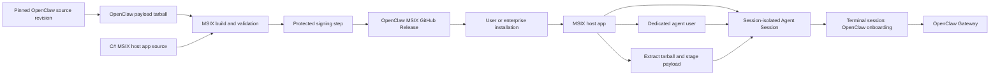

# Proposal: OpenClaw MSIX Packaging for Windows

## Summary

Define a reproducible packaging and release pipeline for deploying OpenClaw on
Windows as an MSIX package. A dedicated `openclaw/openclaw-msix-packaging`
repository will build a package-specific host app and an OpenClaw payload
tarball from a commit pinned for each MSIX release, validate
architecture-specific artifacts with GitHub Actions, and publish them through
GitHub Releases. The installed host app will provision and manage an Agent
Session under a dedicated agent user, then run the OpenClaw Gateway inside
that session. This provides stable app identity, enterprise-friendly
deployment, and a contained runtime boundary for OpenClaw on Windows.

## Motivation

Enterprise administrators need a way to identify, inventory, approve, deploy,
and remove OpenClaw consistently from managed Windows devices. A dedicated
OpenClaw MSIX artifact gives the Windows installation a stable, reviewable
package identity, declared capabilities, and a standard Windows
application-management surface, inspectable and governed like any other
managed application.

Package identity alone is not a runtime security boundary for an autonomous
agent: the OpenClaw Gateway can execute tools, connect to services, and act on
a user's behalf. The managed deployment should therefore run the Gateway in a
separate, session-isolated Agent Session under a dedicated agent user rather
than the interactive user's own session. The host app included in the MSIX
package is responsible for provisioning that session, staging the OpenClaw
payload, and controlling the Gateway lifecycle.

Keeping the packaging definition in a dedicated repository also supports trust
and maintainability: contributors and enterprise reviewers can determine
exactly which source revision, capabilities, build tools, signing steps, and
release checks produced a given OpenClaw MSIX artifact.

## Goals

- Create an `openclaw/openclaw-msix-packaging` repository containing the
  Windows host app, package definitions, release workflows, validation, and
  contributor documentation.
- Produce reviewable and reproducible MSIX builds from an explicitly pinned
  OpenClaw source revision as the only external product source input.
- Include a package-specific host app that provisions the dedicated agent user,
  creates the Agent Session, and manages the packaged Gateway lifecycle.
- Publish signed MSIX artifacts under a stable OpenClaw-controlled identity,
  with checksums and source-version metadata, through GitHub Releases.
- Make the [Windows companion app](https://github.com/openclaw/openclaw-windows-node) present **Install OpenClaw MSIX** as the
  default or preferred option for creating a local OpenClaw Gateway.

## Non-Goals

- Publishing through or depending on the Microsoft Store, including
  Store-managed updates.
- Enabling unattended package auto-update by default. IT administrators remain
  responsible for managing package updates.
- Defining every enterprise runtime policy, data-loss-prevention rule, or tool
  authorization rule that may be applied to OpenClaw.

## Proposal

### Repository and ownership

Create a dedicated `openclaw/openclaw-msix-packaging` repository. It owns the
Windows-specific host app and the packaging of OpenClaw source into
release-ready MSIX artifacts. The repository should contain:

- Source for the package-specific host app.
- MSIX manifests and package assets.
- Scripts that acquire and verify a pinned OpenClaw source revision.
- Build orchestration for x64 and ARM64.
- GitHub Actions workflows for pull requests, release candidates, and releases.
- Documentation for local builds, release operations, signing, installation,
  upgrade, rollback, and uninstall behavior.

The only product source input is the OpenClaw repository. The packaging
repository must not carry a long-lived copy of OpenClaw source; each MSIX
release instead pins the exact OpenClaw source revision it packages. Build
toolchains and packaging dependencies are locked in the packaging repository.

The host app is packaging infrastructure specific to the Windows MSIX
deployment. It is not a fork of the OpenClaw Gateway and must keep its
responsibilities narrow: package activation, Agent Session provisioning,
Gateway lifecycle, health, repair, and cleanup.

### Build and release pipeline

GitHub Actions should provide three levels of validation:

1. Pull requests build non-production packages and run manifest, payload, and
   installation tests without access to production signing credentials.
2. Release-candidate workflows build from a clean checkout using the pinned
   OpenClaw source revision and produce artifacts for manual validation.
3. A protected release workflow signs the approved artifacts, verifies the
   resulting signatures and payloads, and publishes a GitHub Release.

The release workflow should:

- Restore dependencies from locked manifests, then build the host app,
  OpenClaw payload, and required runtime components for x64 and ARM64.
- Produce architecture-specific `.msix` files (and a combined `.msixbundle`,
  if adopted), validating package identity, capabilities, entry points, and
  payload inventory.
- Sign production artifacts with an OpenClaw-controlled code-signing identity
  and verify the resulting signature.
- Generate SHA-256 checksums, an SBOM, and build provenance.
- Publish release notes identifying the OpenClaw source revision and any
  security-relevant packaging changes.

Production signing credentials must be supplied through a protected signing
service or GitHub environment. They must never be committed to the repository
or exposed to pull-request workflows.

### Package and runtime architecture

The MSIX package provides OpenClaw's Windows package identity, a Gateway
payload built from a pinned source revision, declared capabilities, packaged
entry points, and a host app that manages the contained runtime.

On first-run setup, the host app should:

1. Verify that the package identity, publisher, architecture, OpenClaw version,
   and payload inventory match the signed package metadata.
2. Provision a dedicated agent user through the supported Windows APIs.
3. Create a session-isolated Agent Session for that agent user.
4. Extract the OpenClaw payload from its packaged tarball and stage it inside
   the Agent Session.
5. Start a terminal session within the Agent Session that runs OpenClaw's
   onboarding, matching the onboarding experience of a standard OpenClaw
   install.
6. Start and stop the Gateway through a narrow lifecycle interface.
7. Clean up or explicitly preserve Gateway state and Agent Session resources
   during repair, reset, rollback, and uninstall.

The host app should expose a stable way for OpenClaw clients and nodes to obtain
the Gateway endpoint and complete normal pairing. Those clients are consumers
of a running Gateway; they do not own the Agent Session or Gateway lifecycle.

The Gateway must not silently fall back to running under the interactive user
when Agent Session provisioning fails. Enterprise policy must be able to require the session-isolated mode and disable
fallbacks.

Package data and long-lived Gateway state must have an explicit lifecycle.
Updating or uninstalling the MSIX package must not leave an unknown running
Gateway, orphaned agent account, or inaccessible state. If Windows cannot
remove Agent Session state transactionally with package removal, the host app
must expose a supported cleanup flow and clearly warn administrators before
uninstall.

**Figure 1.** The packaging repository builds an OpenClaw payload tarball from
a pinned source revision and packages it with a C# host app, preferably
published with NativeAOT, into the MSIX. After installation, that host app
provisions the dedicated agent user and Agent Session, extracts and stages the
payload into that session, and starts a terminal session that runs OpenClaw's
onboarding — the same onboarding experience as a standard OpenClaw install —
before the Gateway runs. MSIX identity and runtime isolation are complementary
controls.

### Distribution and updates

GitHub Releases are the canonical distribution point for the first version of
this proposal. A release should provide direct artifact links, checksums,
signatures, provenance, release notes, and an SBOM.

For enterprise deployments, the initial update flow is administrator
controlled:

1. An administrator selects an exact OpenClaw MSIX release.
2. The administrator reviews the release notes, declared package
   capabilities, included component versions, signature, checksums, SBOM,
   and provenance.
3. The organization validates the package and Gateway payload in its own test
   environment.
4. The administrator approves and imports the exact artifact into the
   organization's Windows application-management system.
5. The management system stages or deploys the approved version according to
   organization rollout and rollback policy.

The installed package and host app must not bypass that process by fetching and
installing a newer OpenClaw payload on their own. Unattended auto-update is
disabled by default in v1.

For consumer installations, v1 may provide a manual update check or link to an
explicit GitHub Release, but installation still requires a clear user action.
The final consumer update experience remains to be determined.

### Windows companion app setup integration

After the MSIX release reaches the readiness bar below, the Windows companion
app setup UI should replace its current WSL recommendation with **Install
OpenClaw MSIX** as the default or preferred option for creating a local Gateway.
Selecting it should download/launch the approved MSIX installation flow or direct the
user to the appropriate artifact.

### Release readiness

MSIX should become the preferred Windows installation mechanism once:

- x64 and ARM64 packages are built and signed through the packaging pipeline.
- Install, upgrade, rollback, repair, reset, and uninstall paths have automated
  and manual coverage.
- Package capability changes are reviewable and release-blocking.
- Agent user and Agent Session provisioning, recovery, and cleanup have a
  documented support boundary.
- The host app can provision and operate a packaged local Gateway without
  silently reducing its isolation.
- Existing local Gateway users, including WSL users, have a documented migration
  path to the packaged deployment.

Developer, source-based, and remote-Gateway paths can remain available during
the transition, but Windows installation documentation should prefer the
OpenClaw MSIX artifact after the release criteria are satisfied.

## Rationale

- MSIX is preferred over making a source checkout, bootstrap script, or loose
archive the enterprise deployment contract because it provides a stable package
identity, declarative manifest, signed artifact, predictable lifecycle, and
integration with Windows application-management systems. These properties make
the installed application and its requested capabilities easier to inventory
and review.

- MSIX is not a substitute for Gateway containment — a packaged desktop
application can still execute with broad user access. As covered in
Motivation, the dedicated agent user and session-isolated Agent Session
provide the runtime boundary; the MSIX only identifies and deploys the
workload that the host app then contains.

- A separate packaging repository creates a focused review and ownership boundary
for the host app, manifests, OpenClaw source pinning, signing, and release
policy. It avoids adding Windows-specific packaging and signing machinery to the
core OpenClaw repository while still consuming OpenClaw directly from an exact
source revision rather than maintaining a fork.

- GitHub Releases are preferred over Microsoft Store publication for the initial
rollout because they keep the artifact and build evidence reviewable while
allowing enterprises to validate and redistribute an exact approved package
through their existing management systems. Store publication can be considered
separately if consumer distribution requirements justify its policy, identity,
and update implications.

- Disabling unattended auto-update by default prioritizes administrator control,
reproducibility, and rollback over consumer convenience. This is the safer
starting point for a package whose payload can execute agent actions. A
consumer-friendly update channel can be added after its consent, verification,
and rollback behavior are defined.

## Unresolved questions

- Which Windows execution-container or Agent Session APIs are required, what
  is their minimum supported Windows version, and what support state is required
  before MSIX becomes the default?
- Which capabilities must be declared in the package manifest, and which
  changes require explicit security review?
- What is the exact migration path for an existing WSL-based or source-based
  local Gateway?
- How are Gateway data, agent accounts, and Agent Session resources cleaned
  up during uninstall, failed setup, rollback, or package identity changes?
- Can an administrator roll back the package without rolling back or corrupting
  Gateway state?
- How should enterprise deployment systems receive revocation or urgent
  security-update guidance without allowing clients to install unapproved
  payloads?
