# Proposal: OpenClaw MSIX Packaging for Windows

## Summary

Define a reproducible packaging and release pipeline for deploying OpenClaw on
Windows as an MSIX package. A dedicated `openclaw/openclaw-msix-packaging`
repository will build a package-specific host app and an OpenClaw payload
tarball from a commit pinned for each MSIX release, validate
architecture-specific artifacts with GitHub Actions, and publish them through
GitHub Releases. After installation, the host app will verify and stage the
payload, run OpenClaw onboarding, and manage the Gateway lifecycle. This
provides stable app identity, enterprise-friendly deployment, and predictable
installation and update behavior on Windows.

## Motivation

Enterprise administrators need a way to identify, inventory, approve, deploy,
and remove OpenClaw consistently from managed Windows devices. A dedicated
OpenClaw MSIX artifact gives the Windows installation a stable, reviewable
package identity, declared capabilities, and a standard Windows
application-management surface, inspectable and governed like any other
managed application.

MSIX package identity and signing do not by themselves define how the Gateway
payload is prepared or how long-lived state survives package updates. The host
app included in the MSIX package is responsible for verifying and staging the
payload, running onboarding, and controlling the Gateway lifecycle. This keeps
Windows packaging behavior out of the OpenClaw core.

Keeping the packaging definition in a dedicated repository also supports trust
and maintainability: contributors and enterprise reviewers can determine
exactly which source revision, capabilities, build tools, signing steps, and
release checks produced a given OpenClaw MSIX artifact.

## Goals

- Create an `openclaw/openclaw-msix-packaging` repository containing the
  Windows host app, package definitions, release workflows, validation, and
  contributor documentation.
- Produce reviewable and reproducible MSIX builds whose OpenClaw payload is
  built from an explicitly pinned revision of the official
  [`openclaw/openclaw`](https://github.com/openclaw/openclaw) repository.
- Include a package-specific host app that verifies and stages the packaged
  payload and manages the Gateway lifecycle.
- Publish signed MSIX artifacts under a stable OpenClaw-controlled identity,
  with checksums and source-version metadata, through GitHub Releases.
- Make the [Windows companion app](https://github.com/openclaw/openclaw-windows-node) present **Install OpenClaw MSIX** as the
  default or preferred option for creating a local OpenClaw Gateway.

## Non-Goals

- Publishing through or depending on the Microsoft Store, including
  Store-managed updates.
- Enabling unattended package auto-update by default. IT administrators remain
  responsible for managing package updates.
- Defining every enterprise runtime policy, data-loss-prevention rule, or tool
  authorization rule that may be applied to OpenClaw.
- Defining runtime isolation. A separate RFC may define a session-based runtime
  model.

## Proposal

### Repository and ownership

Create a dedicated `openclaw/openclaw-msix-packaging` repository. It owns the
Windows-specific host app and the packaging of OpenClaw source into
release-ready MSIX artifacts. The repository should contain:

- Source for the package-specific host app.
- MSIX manifests and package assets.
- Scripts that acquire and verify a pinned OpenClaw source revision.
- Build orchestration for x64 and ARM64.
- GitHub Actions workflows for pull requests, release candidates, and releases.
- Documentation for local builds, release operations, signing, installation,
  upgrade, rollback, and uninstall behavior.

The official
[`openclaw/openclaw`](https://github.com/openclaw/openclaw) repository is the
source of truth for the OpenClaw payload. The packaging repository must not
carry a long-lived copy or fork of OpenClaw source; each MSIX release instead
pins the exact upstream revision it packages. This does not make OpenClaw the
build's only input: host app source, bootstrapper, runtime components,
toolchains, and packaging dependencies are separate inputs that must be pinned,
verified, and recorded in the release SBOM and provenance.

The host app is packaging infrastructure specific to the Windows MSIX
deployment. It is not a fork of the OpenClaw Gateway and must keep its
responsibilities narrow: package activation, payload verification and staging,
Gateway lifecycle, health, repair, and cleanup.

### Build and release pipeline

GitHub Actions should provide three levels of validation:

1. Pull requests build non-production packages and run manifest, payload, and
   installation tests without access to production signing credentials.
2. Release-candidate workflows build from a clean checkout using the pinned
   OpenClaw source revision and produce artifacts for manual validation.
3. A protected release workflow signs the approved artifacts, verifies the
   resulting signatures and payloads, and publishes a GitHub Release.

After the MSIX distribution path meets the release-readiness criteria in this
RFC, the production release cadence should follow OpenClaw's release channels:

- Every OpenClaw release promoted to the `stable` channel, including subsequent
  security or reliability updates to the active stable line, should have a
  corresponding production-signed MSIX release.
- Beta or other prerelease OpenClaw releases may produce clearly labeled
  prerelease MSIX artifacts for validation.
- Moving `dev` or `main` builds may produce CI artifacts, but must not be
  published as production MSIX releases.

Packaging-only fixes may publish a new MSIX package revision while retaining
the same embedded OpenClaw version. Release metadata must identify both the
MSIX package version and the exact OpenClaw version it contains.

The release workflow should:

- Restore dependencies from locked manifests, then build the host app,
  OpenClaw payload, and required runtime components for x64 and ARM64.
- Produce architecture-specific `.msix` files (and a combined `.msixbundle`,
  if adopted), validating package identity, capabilities, entry points, and
  payload inventory.
- Sign production artifacts with an OpenClaw-controlled code-signing identity
  and verify the resulting signature.
- Generate SHA-256 checksums, an SBOM, and build provenance.
- Publish release notes identifying the OpenClaw source revision and any
  security-relevant packaging changes.

Production signing credentials must be supplied through a protected signing
service or GitHub environment. They must never be committed to the repository
or exposed to pull-request workflows.

### Package and runtime architecture

The MSIX package provides OpenClaw's Windows package identity, a Gateway
payload built from a pinned source revision, declared capabilities, packaged
entry points, and a host app that manages payload setup and the Gateway
lifecycle.

On first-run setup, the host app should:

1. Verify that the package identity, publisher, architecture, OpenClaw version,
   payload digest, and payload inventory match the signed package metadata.
2. Extract the OpenClaw payload from its packaged tarball into a clean,
   versioned staging directory.
3. Verify the staged files against the payload inventory before activation.
4. Run OpenClaw's onboarding, matching the onboarding experience of a standard
   OpenClaw install.
5. Start and stop the Gateway through a narrow lifecycle interface.
6. Clean up or explicitly preserve Gateway state during repair, reset,
   rollback, and uninstall.

The host app should expose a stable way for OpenClaw clients and nodes to obtain
the Gateway endpoint and complete normal pairing. Those clients are consumers
of a running Gateway; they do not own its lifecycle.

Behavior for multiple Windows users must be explicit, including ownership of
the staged payload, Gateway state, credentials, and endpoints.

Staged payload files and long-lived Gateway state must have an explicit
lifecycle. Updating or uninstalling the MSIX package must not leave an unknown
running Gateway or inaccessible state. If Windows cannot remove external state
transactionally with package removal, the host app must expose a supported
cleanup flow and clearly warn administrators before uninstall.

```mermaid
flowchart LR
  Pin[Pinned OpenClaw source revision] --> Tarball[OpenClaw payload tarball]
  Tarball --> CI[MSIX build and validation]
  Host["C# MSIX host app source"] --> CI
  CI --> Sign[Protected signing step]
  Sign --> GH[OpenClaw MSIX GitHub Release]
  GH --> Install[User or enterprise installation]
  Install --> App[MSIX host app]
  App --> Verify["Verify payload tarball and inventory"]
  Verify --> Stage["Extract to clean versioned staging"]
  Stage --> Onboarding["Run OpenClaw onboarding"]
  Onboarding --> Gateway[OpenClaw Gateway]
  App -->|Manage lifecycle| Gateway
```

**Figure 1.** The packaging repository builds an OpenClaw payload tarball from
a pinned source revision and packages it with a C# host app, preferably
published with NativeAOT, into the MSIX. After installation, that host app
verifies the tarball and file inventory, extracts the payload into clean
versioned staging, runs OpenClaw's onboarding, and manages the Gateway
lifecycle. The tarball provides a single payload unit to hash, inventory, and
audit.

### Distribution and updates

GitHub Releases are the canonical distribution point for the first version of
this proposal. A release should provide direct artifact links, checksums,
signatures, provenance, release notes, and an SBOM.

Enterprise administrators should handle OpenClaw MSIX like any other Windows
app distributed outside the Microsoft Store. They should use their existing
tools and policies to review, test, approve, deploy, update, and roll back a
specific signed release. OpenClaw does not require a separate IT deployment
process.

The installed package and host app must not bypass administrator approval by
fetching and installing a newer OpenClaw payload on their own. Unattended
auto-update is disabled by default in v1.

For consumer installations, v1 may provide a manual update check or link to an
explicit GitHub Release, but installation still requires a clear user action.
The final consumer update experience remains to be determined.

### Windows companion app setup integration

After the MSIX release reaches the readiness bar below, the Windows companion
app setup UI should replace its current WSL recommendation with **Install
OpenClaw MSIX** as the default or preferred option for creating a local Gateway.
Selecting it should download/launch the approved MSIX installation flow or direct the
user to the appropriate artifact.

### Release readiness

MSIX should become the preferred Windows installation mechanism once:

- x64 and ARM64 packages are built and signed through the packaging pipeline.
- The payload tarball and staged files are verified before activation.
- Install, update, rollback, repair, reset, and uninstall paths have automated
  and manual coverage.
- Gateway state ownership and cleanup are documented, including behavior for
  multiple Windows users.
- Package capability changes are reviewable and release-blocking.
- Existing local Gateway users, including WSL users, have a documented migration
  path to the packaged deployment.

Developer, source-based, and remote-Gateway paths can remain available during
the transition, but Windows installation documentation should prefer the
OpenClaw MSIX artifact after the release criteria are satisfied.

## Rationale

- MSIX is preferred over making a source checkout, bootstrap script, or loose
archive the enterprise deployment contract because it provides a stable package
identity, declarative manifest, signed artifact, predictable lifecycle, and
integration with Windows application-management systems. These properties make
the installed application and its requested capabilities easier to inventory
and review.

- A separate host app keeps Windows packaging and lifecycle code out of
OpenClaw core. It owns payload verification and staging, onboarding, Gateway
lifecycle, health, repair, and cleanup.

- A payload tarball gives each release one unit to hash, inventory, and audit.
Clean versioned staging keeps updates and rollback predictable, while keeping
the package format independent of later runtime changes.

- A separate packaging repository creates a focused review and ownership boundary
for the host app, manifests, OpenClaw source pinning, signing, and release
policy. It avoids adding Windows-specific packaging and signing machinery to the
core OpenClaw repository while still consuming OpenClaw directly from an exact
source revision rather than maintaining a fork.

- GitHub Releases are preferred over Microsoft Store publication for the initial
rollout because they keep the artifact and build evidence reviewable while
allowing enterprises to validate and redistribute an exact approved package
through their existing management systems. Store publication can be considered
separately if consumer distribution requirements justify its policy, identity,
and update implications.

- Disabling unattended auto-update by default prioritizes administrator control,
reproducibility, and rollback over consumer convenience. This is the safer
starting point for a package whose payload can execute agent actions. A
consumer-friendly update channel can be added after its consent, verification,
and rollback behavior are defined.

## Unresolved questions

- Which capabilities must be declared in the package manifest, and which
  changes require explicit security review?
- What is the exact migration path for an existing WSL-based or source-based
  local Gateway?
- What are the ownership rules for Gateway state, credentials, and endpoints
  when multiple Windows users install or run the package?
- How are payload files and Gateway state cleaned up during uninstall, failed
  setup, rollback, or package identity changes?
- Can an administrator roll back the package without rolling back or corrupting
  Gateway state?
- How should enterprise deployment systems receive revocation or urgent
  security-update guidance without allowing clients to install unapproved
  payloads?
